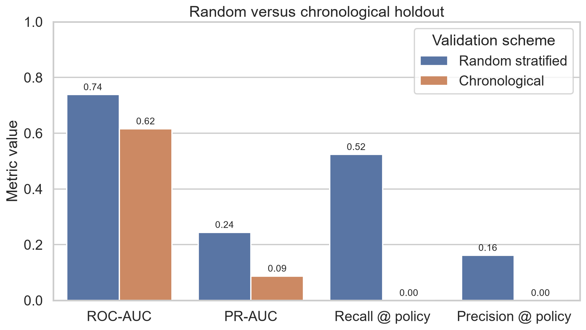

# Semiconductor Yield Excursion Monitoring & Root-Cause Triage

An evidence-led machine-learning project using the UCI SECOM manufacturing
dataset to identify high-risk semiconductor process runs. The project is built
for technical review and interview discussion: every reported result is
reproducible, preprocessing is fitted inside cross-validation, and the final
holdout set is not used for model or threshold selection.



## Research question

Can rare semiconductor manufacturing failures be ranked reliably from hundreds
of partly missing, anonymised process measurements—and does performance remain
credible when the model is evaluated on later production runs rather than a
random split?

The central finding is methodological rather than promotional: random-holdout
performance looked useful, but chronological performance declined materially.
The repository therefore treats temporal robustness, uncertainty, operating
capacity, and model limitations as first-class results instead of presenting a
single favourable score.

The original supervised baseline and enhanced temporal analysis remain intact.
The new monitoring layer adds leakage-safe Phase I/Phase II SPC, multivariate
PCA monitoring, capacity-based strategy comparison, and association-only
candidate-variable triage.

## Why this problem matters

SECOM contains anonymised measurements collected from a semiconductor
manufacturing process. Only a small fraction of the runs fail, while hundreds
of partly missing sensor variables are available. That combination creates the
core modelling challenges seen in manufacturing fault detection:

- high dimensionality relative to sample count;
- missing and non-informative measurements;
- severe pass/fail imbalance;
- asymmetric operational costs for missed failures and false alarms.

## Dataset

- 1,567 manufacturing examples
- 590 anonymised process measurements
- 104 failures and 1,463 passes
- timestamps and naturally occurring missing values
- source: [UCI Machine Learning Repository](https://archive.ics.uci.edu/dataset/179/secom)
- citation: McCann, M. & Johnston, A. (2008), *SECOM*, DOI 10.24432/C54305
- license: CC BY 4.0

## Method

The baseline workflow uses a stratified 80/20 train/holdout split. Candidate
models are compared with repeated stratified cross-validation on the training
partition using PR-AUC as the primary selection metric. Every candidate is an
`sklearn` pipeline, so missingness filtering, median imputation, constant
feature removal, scaling, feature selection, or PCA are learned from each
training fold rather than from the complete dataset.

Candidate models:

1. class-weighted logistic regression with univariate feature selection;
2. class-weighted logistic regression with 40 randomised-SVD PCA components;
3. class-weighted random forest;
4. class-weighted random forest with missingness indicators;
5. class-weighted histogram gradient boosting.

Models within 0.005 absolute mean CV PR-AUC are treated as practical ties. The
tie is resolved using lower PR-AUC variability and then higher ROC-AUC, which
prevents a negligible decimal improvement from automatically selecting a more
complex pipeline.

After model selection, an operating threshold is frozen from out-of-fold
training probabilities. The illustrative cost policy assigns a missed failure
10 times the cost of a false alarm. This assumption is explicit and can be
changed; it is not presented as a real fabrication-facility cost estimate.

## Run locally

```powershell
python -m venv .venv
.\.venv\Scripts\python.exe -m pip install -r requirements.txt
.\.venv\Scripts\python.exe scripts\download_data.py
$env:PYTHONPATH = "$PWD\src"
.\.venv\Scripts\python.exe -m pytest
.\.venv\Scripts\python.exe scripts\run_baseline.py
.\.venv\Scripts\python.exe scripts\run_enhanced_analysis.py
.\.venv\Scripts\python.exe scripts\run_spc_analysis.py
.\.venv\Scripts\python.exe scripts\run_root_cause_triage.py
.\.venv\Scripts\streamlit.exe run app\streamlit_app.py
```

Generated evidence is stored under `reports/tables/`, `reports/figures/`, and
`reports/baseline_summary.json`.

## Repository structure

```text
├── notebooks/                 Executed narrative analysis
├── reports/figures/           Publication-ready result figures
├── reports/tables/            Metrics and robustness evidence
├── scripts/                   Data download and experiment entry points
├── src/secom_project/         Reusable data, modelling, and evaluation code
├── tests/                     Data-contract and evaluation tests
├── README.md                  Project overview and interpretation
└── reports/model_card.md      Intended use, limitations, and risk statement
```

Raw UCI files are deliberately excluded from version control. The download
script retrieves the official archive and the data provenance is documented in
[`data/README.md`](data/README.md). Project code is released under the MIT
License; the SECOM dataset remains under its stated CC BY 4.0 license.

## Baseline results

The random forest ranked first by mean repeated-CV PR-AUC on the training
partition (0.178, standard deviation 0.081). On the untouched 314-run holdout
set, which contained 21 failures, it achieved:

- ROC-AUC: **0.739**
- PR-AUC / average precision: **0.244**, versus a 0.067 failure-rate baseline
- recall at the default 0.50 threshold: **0.048** (1 of 21 failures detected)
- recall at the training-derived 0.15 threshold: **0.524** (11 of 21 detected)
- precision at the 0.15 threshold: **0.162**
- balanced accuracy at the 0.15 threshold: **0.665**

The threshold comparison is the main operational finding: a model can have
reasonable ranking performance while a default classification threshold makes
it nearly useless for rare-failure screening. The lower threshold increased
failure detection but also flagged 57 passing runs, so it is an explicit
screening trade-off rather than a claim of deployment readiness.

Held-out permutation importance ranked `sensor_059` first, with a mean decrease
of 0.058 in average precision when shuffled. Because the variables are
anonymised and the importance estimate is based on a small holdout set, this is
a prioritisation signal for further engineering investigation, not a physical
root-cause conclusion.

## Robustness results

The main iteration adds a chronological holdout: the earliest 80% of runs are
used for training and expanding-window threshold selection, while the latest
20% (2-17 October 2008) are evaluated once. Performance declined materially:

| Validation scheme | ROC-AUC | PR-AUC | Test failures |
| --- | ---: | ---: | ---: |
| Random stratified holdout | 0.739 | 0.244 | 21 |
| Chronological holdout | 0.616 | 0.087 | 17 |

The 95% stratified-bootstrap interval for random-holdout ROC-AUC was
0.620-0.846 and for PR-AUC was 0.130-0.433. Chronological intervals were
0.480-0.760 and 0.061-0.170 respectively. These wide intervals are part of the
result: only 104 failures exist in the full dataset.

The 10:1 cost threshold selected from temporally ordered validation predictions
did not transfer to the latest holdout: it detected none of the 17 failures.
Accordingly, the project does not promote one universal decision threshold.
Risk ranking remained directionally useful: reviewing the top 10% highest-risk
late runs captured 17.6% of failures, a 1.73x lift over random review; reviewing
the top 20% captured 35.3%.

Calibration methods also disagreed. Isotonic calibration produced the lowest
Brier score and five-bin calibration error on the random holdout, while sigmoid
calibration produced the best log loss. No calibrated probability scale is
promoted for policy use from this small sample.

Across 10 repeated-CV folds, `sensor_103` and `sensor_059` appeared in the
random forest's top 20 every time. This is evidence of ranking stability for
the fitted workflow, not proof that either variable is a physical cause.

## Excursion-monitoring workflow

The added research question is whether reference-fitted SPC signals identify
later process excursions, and whether they complement the existing supervised
failure-risk ranking without using the final chronological holdout for fitting
or tuning.

The chronological split is unchanged: the earliest 1,253 runs are development
data and the latest 314 runs are the final holdout. Within development data,
the earliest 751-run window is Phase I. Its 684 historically labelled pass runs
form a **label-assisted historical reference**. This is a practical proxy for
normal operation, not a validated in-control production period. The remaining
502 development runs are Phase II.

All imputation, scaling, 15-variable monitoring selection, PCA dimensions,
control limits, and combined-score weights are fitted without final-holdout
labels. PCA retained 9 components to cover at least 90% of reference variance;
empirical 99th percentiles of Phase I reference scores set the T² limit
(79.473) and Q/SPE limit (11.279).

## SPC and engineering-strategy results

The final-period result is deliberately negative rather than cosmetically
optimised. I-MR, EWMA, and CUSUM each alerted on 100% of holdout runs, while
Hotelling's T² alerted on 83.1%; these signals captured many failures but had
unacceptable false-positive rates and are evidence of broad distribution
shift. Q/SPE produced one alert and captured no failures.

| Strategy | Capacity | Failures captured | Failure capture | Lift over random |
| --- | ---: | ---: | ---: | ---: |
| Existing ML risk | 10% | 3 / 17 | 17.6% | 1.73x |
| Existing ML risk | 20% | 6 / 17 | 35.3% | 1.76x |
| SPC severity | 10% | 0 / 17 | 0.0% | 0.00x |
| SPC severity | 20% | 1 / 17 | 5.9% | 0.29x |

Training-period weight selection chose ML=0 and SPC=1 for the optional blend,
so the combined ranking reduced to SPC and did not improve final performance.
This negative result is retained. SPC alerts are not supervised
classifications: a classifier ranks labelled failure risk, while SPC asks
whether measurements depart from a historical reference. An excursion can be
real without a recorded failure, and a failure can occur without an SPC alert.

## Candidate process-variable triage

The consensus ranking combines chronological-training-only feature stability,
permutation importance, standardized failure/pass association, missing-rate
and KS drift, EWMA/CUSUM violation frequency, PCA Q/SPE contribution, and rank
stability across training windows. The leading candidates are `sensor_021`,
`sensor_247`, `sensor_059`, `sensor_519`, and `sensor_129`. These anonymous
features establish investigation priority and association only; they do not
identify a physical mechanism or establish causality.

Generated evidence is stored in `mspc_run_scores.csv`,
`spc_method_comparison.csv`, `monitoring_strategy_comparison.csv`,
`candidate_process_variables.csv`, and `run_level_triage.csv` under
`reports/tables/`, with corresponding timeline, capacity, ranking, effect-size,
and control-chart figures under `reports/figures/`. The Streamlit dashboard
reads these artifacts only and never retrains at startup.

## Interpretation limits

The feature names are anonymised, so this project can rank influential process
variables but cannot honestly label them as pressure, temperature, flow rate,
or another physical parameter. Results demonstrate a defensible analytical
workflow, not deployment readiness or causal root-cause identification. The
chronological degradation also shows that a model validated by random splitting
can overstate future-process performance when the observed process distribution
changes over time.

No Cp/Cpk is calculated because real LSL/USL values are unavailable. The data
also lack lot, wafer, equipment, chamber, recipe, and maintenance identifiers,
so the project cannot support wafer/lot/equipment analysis. It does not measure
true early-warning lead time and is only an offline research workflow.

## Open-source review

Several public semiconductor projects were inspected for workflow ideas such
as leakage-safe pipelines, class-imbalance handling, threshold analysis, and
clear separation of model selection from final evaluation. No third-party
project code or claimed performance result is copied into this repository.

Reviewed references include:

- [UCI SECOM dataset](https://archive.ics.uci.edu/dataset/179/secom)
- [Defect Prediction in Semiconductor Lithography](https://github.com/PanithanS/Defect-Prediction-in-Semiconductor-Lithography)
- [SECOM Fault Detection](https://github.com/Spalding13/secom-fault-detection)
- [Semiconductor Yield Root Cause](https://github.com/virgil-castillo/semiconductor-yield-root-cause)
- [Fab Process Quality and Yield-Risk Monitoring](https://github.com/gaurabkaju/fab-quality-system)
- [scikit-learn threshold tuning](https://scikit-learn.org/stable/modules/classification_threshold.html)
- [scikit-learn probability calibration](https://scikit-learn.org/stable/modules/calibration.html)
