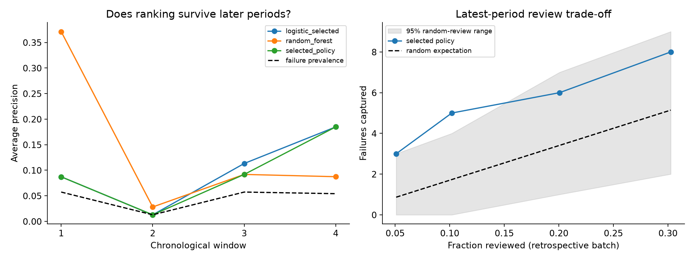

# Failure Risk under Process Drift
## A retrospective machine-learning study of semiconductor manufacturing data

Can a model learned from historical process measurements remain useful in later
production periods? This materials MSc portfolio study examines that question
using public UCI SECOM data: **1,567 runs, 590 anonymous variables, 104 failures**.

The contribution is an auditable comparison of **time generalization, alarm
failure and review trade-offs**. It does not establish a physical root cause,
a measured yield improvement or production readiness. Implementation and
documentation were developed with AI assistance; see [contributions](docs/CONTRIBUTIONS.md).



### What the current evidence says

- Earlier-only model selection chose logistic regression for the latest 314-run
  period: **average precision 0.185**, versus failure prevalence **0.054**.
- Reviewing 32 runs (10.2%) captured **5 of 17 failures**, with **27 false alerts**.
  Reviewing 63 runs captured **6 of 17**, with **57 false alerts**.
- Performance was unstable: selected-policy AP across four chronological
  windows was **0.087, 0.013, 0.092, 0.185**. One window had only **2 failures**.
- Latest-period Brier score was **0.182**, worse than constant-prevalence
  prediction (**0.051**). Ranking scores must not be marketed as reliable probabilities.
- The 95% whole-day bootstrap interval for latest-period AP was **0.070–0.418**.
  This is conditional on a fixed fitted model and only 16 observed days.
- Reference-fitted CUSUM still alerted on **every** latest-period run.
  A process excursion is not the same as a recorded failure.

All data periods were inspected during earlier project iterations. These are
**historical backtests**, not newly untouched or external tests. New evaluation
code prevents cross-period fitting leakage; it cannot undo past inspection.

### Three ways to review the project

| Reader | Start here |
| --- | --- |
| Recruiter / quick overview | [Two-minute project brief](docs/PROJECT_BRIEF.md) |
| Technical interviewer | [Study protocol](docs/PROTOCOL.md), [results and interpretation](reports/study/RESULTS.md) |
| Reproduction / code review | [Configuration](configs/study.json), [implementation](src/secom_project/study.py), [tests](tests/test_study.py), [manifest](reports/study/manifest.json) |

### Research structure

1. **Time generalization:** four outer historical windows; model and threshold
   selection use only earlier inner windows. Pipelines fit preprocessing inside
   each training fold. Equal timestamps stay on the same side of each split.
2. **Why alarms fail:** reference sensitivity, per-variable alarms, union effects,
   pass/failure shifts and actual fitted control limits. Two v2 sensor discoveries
   are explicitly post-hoc diagnostic examples.
3. **Review decisions:** fixed capacity curves, exact random-review reference
   ranges, conditional day bootstrap and reproducible captured/missed/false-alert cases.
4. **Known-change simulation:** 200 repeated stable, step and gradual-drift
   experiments. Synthetic behaviour validation is separate from real-data evidence.

Main comparisons are deliberately small: logistic regression, random forest and
constant prevalence. Two fixed RF ablations examine feature selection and
missingness indicators. No outer-period winner is used to retrospectively
change the selection policy. The old arbitrary consensus ranking and ML/SPC
blend are retired from the primary workflow.

### Executed notebooks

- [01 — Data quality and question](notebooks/01_data_and_question.ipynb)
- [02 — Time validation and review](notebooks/02_time_validation_and_review.ipynb)
- [03 — Alarm diagnosis and simulation](notebooks/03_alarm_diagnosis_and_simulation.ipynb)

These are executable review notebooks, not a claim of independently completed
coursework. Source calculations live in reusable Python modules and the run script.

### Reproduce

Python **3.12** is the tested runtime. From the repository root:

```powershell
python -m venv .venv
.\.venv\Scripts\python.exe -m pip install -r requirements-repro.txt
.\.venv\Scripts\python.exe scripts/reproduce.py
.\.venv\Scripts\streamlit.exe run app/streamlit_app.py
```

On Linux/macOS use `.venv/bin/python` and `.venv/bin/streamlit`.
The single reproduction command downloads missing raw data, rebuilds the study,
executes all three notebooks and runs tests. Dashboard startup reads artifacts;
it does not train models. Existing artifacts can be inspected without rerunning.

`requirements-repro.txt` pins the main computation/review dependencies used in
this run. `requirements.txt` states broader supported ranges; a full environment
snapshot is included for diagnosis, not a cross-platform lock guarantee.
The manifest records input/source hashes, actual package versions and configuration.
Numerical tolerances apply across BLAS/OS versions.

### Boundaries

Anonymous measurements do not reveal pressure, temperature, recipe or mechanism.
No wafer, lot, chamber, maintenance or equipment identifiers are supplied. There
are no specification limits for Cp/Cpk and no real early-warning lead time.
Historical pass labels are a reference proxy, not proof of an in-control process.
Label availability at each historical refit is an assumption, not verified fab latency.

Batch top-k review requires the completed batch. Frozen earlier-validation
percentiles are separate descriptive outputs, not a deployed online policy.
Random-review tail probabilities are exploratory and not adjusted for multiple
comparisons. Day bootstrap does not capture model-selection uncertainty.

### Project history and sources

The [v2 archive](reports/legacy_v2/README.md) preserves previous results and
documents why some earlier independence claims needed correction.
[Decision records](docs/DECISIONS.md) describe the actual revision, without
inventing earlier research history.

Data: [UCI SECOM](https://archive.ics.uci.edu/dataset/179/secom),
McCann & Johnston (2008), DOI **10.24432/C54305**, CC BY 4.0.
Code: MIT. Method references are linked in the [protocol](docs/PROTOCOL.md).
